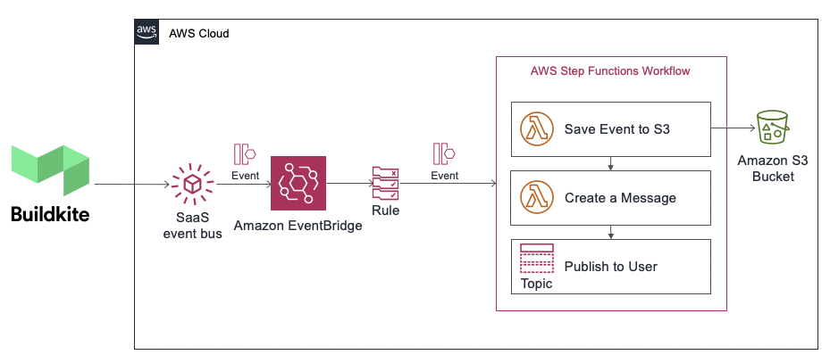

# eventbridge-integration-solution-buildkite-build-workflow
## Amazon EventBridge Integration Solution for Buildkite

This Quick Start demonstrates an integration with AWS Step Functions for Amazon EventBridge with Buildkite. This solution enables your Amazon EventBridge event bus to trigger a rule that evaluates Build Started event from Buildkite and invokes an AWS Step Functions as a target for matched events. Within the Step Functions, there is a state machine that runs a workflow of these steps:

- Lambda function which will load the event information to S3 for later analysis
- Another Lambda function that will extract information from the event and then curates a message, which will then be sent to 
- An SNS Topic that will publish the curated message to subscriber, which in this example is an email.

You can use this as a starter project to extend this solution for any scenario that can use Step Functions to run code.

For details and launch information, see the [data sheet](https://aws.amazon.com/quickstart/eventbridge/aws-lambda/).

To post feedback, submit feature ideas, or report bugs, use the **Issues** section of [this GitHub repo](https://github.com/aws-quickstart/eventbridge-integration-solution-buildkite-build-workflow).